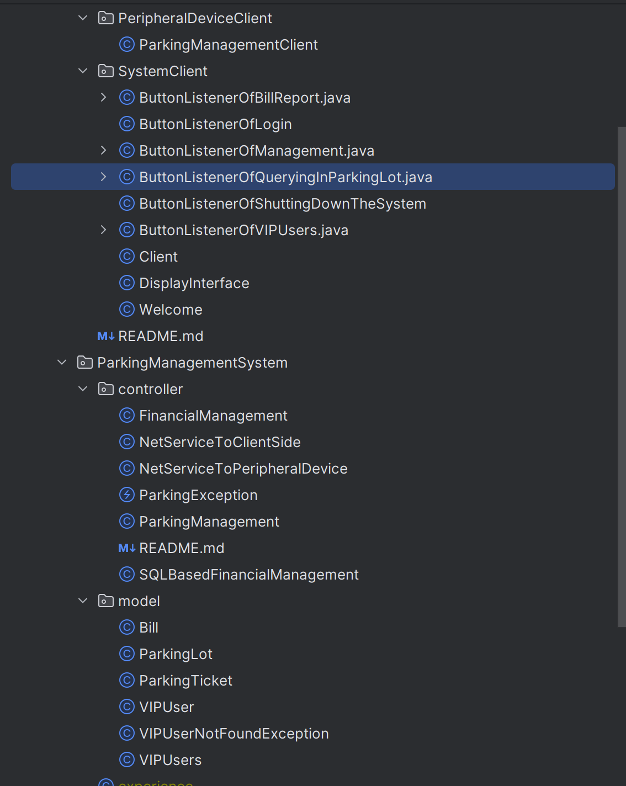
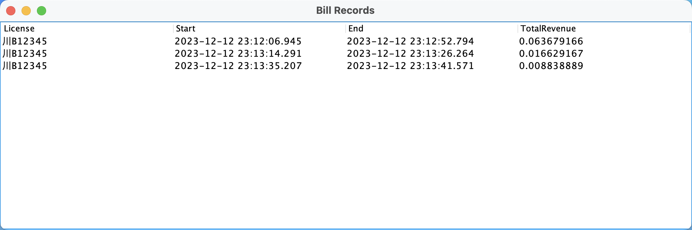

# 项目名称 ParkingManagementByJava


## 构建/安装

- ### 一、 下载并解压H2驱动数据库  

  前往 www.h2database.com/ 下载安装得到`h2-202X-XX-XX.zip`,具体文件名因发行版本日期而不同, 本例使用`h2-2023-09-17.zip`.  
  将其解压得到`h2`文件夹.

  在以下网址下载 org.json 库的JAR文件，并将其添加到项目的lib中：
  https://mvnrepository.com/artifact/org.json/json/20210307

  我已经将这两个JAR文件放在了lib文件夹中。

- ### 二、 配置H2驱动数据库和JSON库

  在IDEA内打开项目.  
  在项目目录下新建文件夹`lib`,将`h2`文件夹拷贝到其下.  
  在IDEA菜单栏依次点击`文件(File)`>>`项目结构(Project Structure)`
  在出现的窗口最左侧`项目设置(Project Settings)`一栏里单击`模块(Modules)`.可以看到第二栏选择了本项目,第三栏内点击`依赖(Dependencies)`,出现下图所示情形.
  
  点击`模块SDK(Module SDK)`下方`+`号,点击`1 JAR或目录(1 JARS or directories)`找到项目目录下`jar`文件`lib/h2/bin/h2-X.X.XXX.jar`,具体文件名因发行版本不同而不同, 本例使用`lib/h2/bin/h2-2.2.224.jar`,点击`确定(OK)`.如下图所示,h2被添加进模块.
  
  此时点击窗口右下角`应用(Apply)`使变更生效,关闭配置窗口.
- ### 三、 运行程序

  在IDEA项目管理器内进行如下操作.  
  找到`src/ParkingManagementSystem/Main.java`文件,右键点击,选择`运行(run)`
  分别找到`src/ClientSide/Client.java`和`src/ClientSide/ParkingManagementClient.java`用同样方式运行.  
  运行后将会看到终端与窗口内容.

- ### 四、 关闭程序
  关闭程序需要进行如下操作.  
  退出`停车管理系统`.  
  在`ParkingManagementClient.java`的终端输入`exit`退出.


## 项目初略说明

整个项目打包为ParkingManagementByJava-main.zip，

可以展开后导入IDEA，导入后系统为如下结构。

系统主要由两个包组成，ClientSide和ParkingManagementSystem。

其中，CLientSide有两个包组成PeripheralDeviceClient、SystemClient；ParkingManagementSystem有两个包组成，controller、model。其中PeripheralDeviceClient模拟边缘设备进行网络通信，SystemClient模拟系统用户进行网络通信，controller中主要是停车系统管理相关类，model主要是数据相关类。


## 使用示例

### 一、 启动服务端，客户端

在IDEA项目管理器内进行如下操作.  
找到`src/ParkingManagementSystem/Main.java`文件,右键点击,选择`运行(run)`
分别找到`src/ClientSide/SystemClient/Client.java`和`src/ClientSide/PeripheralDeviceClient/ParkingManagementClient.java`用同样方式运行

### 二、边缘设备模拟进库和出库

在`ParkingManagementClient.java`的终端里,可以看到提示信息

```
Connected to server. Enter vehicle information (licensePlate,in/out):
```
  在该终端输入正确车辆进出信息,同时算出车辆费用，显示如下
  ```
  >>川A12345,in
  Server response: 
  Success!
  
  >>川A98765,in
  Server response: 
  Success!
  
  >>川A12345,out
  Server response: 
  Success!The cost of 川A12345 is 0.4375125
  ```
  在该终端输入无效操作或者错误信息,显示如下
  ```
  >>川A88888,out
  Server response: 
  failure
  
  >>abc123#@%(
  Server response: 
  failure
  ```
### 三、 登录系统用户客户端
车辆管理界面如下  
  
分别输入账号`1`与密码`1`进入管理系统,如下图所示  


在操作前先在边缘设备终端发送入库和出库车辆信息

```
Connected to server. Enter vehicle information (licensePlate,in/out):
川A12345,in
Server response: 
成功！

川B12345,in
Server response: 
成功！

川C12345
Server response: 
失败

川C12345,in
Server response: 
成功！

川D12345,in
Server response: 
成功！

川B12345,out
Server response: 
成功！川B12345 的费用为 0.063679166

川A12345,out
Server response: 
成功！川A12345 的费用为 0.08804444

```

之后当我们点击查询车辆并输入车牌号时将出现


当我们选择查询账单时，我们输入指定的月份和车牌号时，会出现如下账单列表




如果查询某段时间的总收入，输入起始时间和终止时间，将得到财务总收入


下面是添加vip用户以及查询vip用户的操作


同时当我们的vip用户进行停车操作时，付费会自动减少50%，并且它将会自动会从余额上扣除


## 四，关闭停车系统

需要点击Client类中的gui界面中点击关闭停车系统选项，同时在ParkingManagementClient的终端命令中输入exit命令整个系统才会关闭。