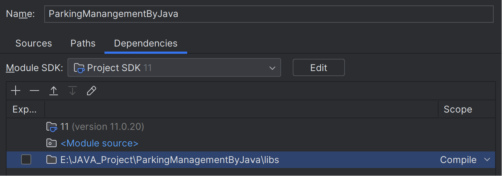

# 项目名称 ParkingManagementByJava


## 构建/安装

- ### 一、 下载并解压H2驱动数据库  

  前往 www.h2database.com/ 下载安装得到`h2-202X-XX-XX.zip`,具体文件名因发行版本日期而不同, 本例使用`h2-2023-09-17.zip`.  
  将其解压得到`h2`文件夹.

- ### 二、 配置H2驱动数据库
  在IDEA内打开项目.  
  在项目目录下新建文件夹`lib`,将`h2`文件夹拷贝到其下.  
  在IDEA菜单栏依次点击`文件(File)`>>`项目结构(Project Structure)`
  在出现的窗口最左侧`项目设置(Project Settings)`一栏里单击`模块(Modules)`.可以看到第二栏选择了本项目,第三栏内点击`依赖(Dependencies)`,出现下图所示情形.
  
  点击`模块SDK(Module SDK)`下方`+`号,点击`1 JAR或目录(1 JARS or directories)`找到项目目录下`jar`文件`lib/h2/bin/h2-X.X.XXX.jar`,具体文件名因发行版本不同而不同, 本例使用`lib/h2/bin/h2-2.2.224.jar`,点击`确定(OK)`.如下图所示,h2被添加进模块.
  
  此时点击窗口右下角`应用(Apply)`使变更生效,关闭配置窗口.
- ### 三、 运行程序
  在IDEA项目管理器内进行如下操作.  
  找到`src/ParkingManagementSystem/Main.java`文件,右键点击,选择`运行(run)`
  分别找到`src/ClientSide/Client.java`和`src/ClientSide/ParkingManagementClient.java`用同样方式运行.  
  运行后将会看到终端与窗口内容.
  
- ### 四、 关闭程序
  关闭程序需要进行如下操作.  
  退出`停车管理系统`.  
  在`ParkingManagementClient.java`的终端输入`exit`退出.

## 使用示例
- ### 一、 车辆停入与驶出
在`ParkingManagementClient.java`的终端里,可以看到提示信息
```
Connected to server. Enter vehicle information (licensePlate,in/out):
```
  在该终端输入正确车辆进出信息,显示如下
  ```
  >>川A12345,in
  Server response: 
  Success!
  
  >>川A98765,in
  Server response: 
  Success!
  
  >>川A12345,out
  Server response: 
  Success!The cost of 川A12345 is 0.4375125
  ```
  在该终端输入无效操作或者错误信息,显示如下
  ```
  >>川A88888,out
  Server response: 
  failure
  
  >>abc123#@%(
  Server response: 
  failure
  ```
- ### 二、 登录管理系统
车辆管理界面如下  
  
分别输入账号`1`与密码`1`进入管理系统,如下图所示  

- ### 三、 选择操作选项
在操作前进入一些车辆,便于进行后续的操作
```
>>川A12345,in
>>川A98765,in
>>川A12123,in
>>渝AA1234,in
>>川B23MW3,in
>>川ZW093,in
```

点击`在库车辆管理`按钮,出现新窗口  
  
点击`查询在库车辆数量以及剩余停车位`按钮,可以查询到如下信息
  