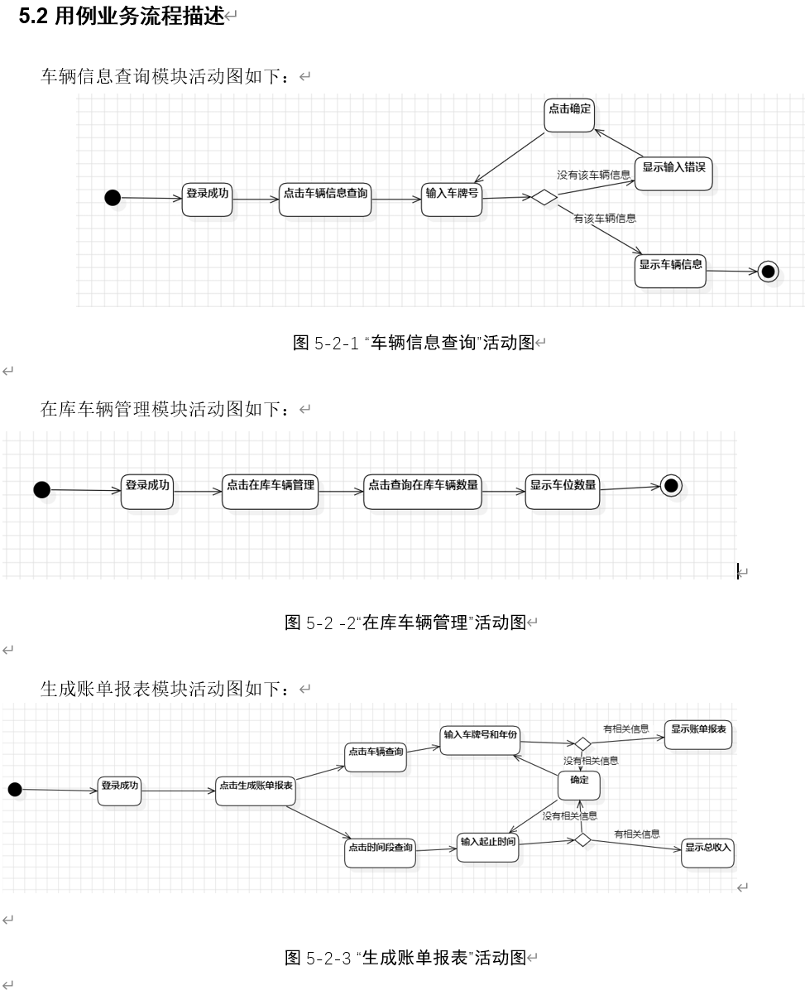

# 停车场管理系统模拟

这个项目是一个停车场系统管理的模拟实现，分为客户端（ClientSide）和服务端（ParkingManagement）两个主要部分。

### 目录结构

##### `ClientSide`：

这个文件夹包含了两个客户端的代码，一个的功能是模拟边缘设备例如车牌号扫描设备，向服务端发送车辆进出信息，另外一个是模拟系统用户登入系统用户客户端界面，允许系统用户进行一系列查询和修改操作。

##### `ParkingManagement`

这个文件夹包含了整个停车管理系统的代码，通过启动文件夹目录下的Main.main(),我们可以启动整个停车系统模块，实现和设备以及系统用户客户端进行通信的功能。

### 如何运行

1. 在 IntelliJ IDEA 中打开项目，并确保已配置 Java SDK。
2. 打开 `ParkingManagementSystem` 模块，找到 `Main` 类，右键单击该类，
  选择 "Run Main.main()"启动服务端。
3. 打开 `ClientSide` 模块，找到 `Client` 和 `ParkingManageClient` 类，
  右键单击每个类 ，选择 "Run" 启动客户端和外围设备模拟。
4. 这是我们系统用户客户端的活动图

确保在运行之前已安装项目所需的依赖项，并根据需要进行配置。
需要配置选项：

1. 安装配置h2驱动数据库，这是参考连接：http://t.csdnimg.cn/naxdB

**注意:**

1. 本停车系统需要正确地关闭，首先，需要点击Client类中的gui界面中点击关闭停车系统选项 ，
    同时在ParkingManagementClient的终端命令中输入exit命令整个系统才会关闭。

### 修改标准和维护标准

以下是一些可能的修改标准：

1. **命名规范：** 根据语言的命名规范，确保变量、函数和类的命名具有描述性，易于理解。
2. **注释添加：** 在关键位置添加详细的注释，解释代码的作用、实现方式以及可能的注意事项。
3. **错误处理：** 确保对可能的错误情况进行适当的处理，以提高代码的健壮性。
4. **代码风格：** 遵循项目中已有的代码风格，确保代码整体风格的一致性。
5. **资源管理：** 在使用资源（例如文件、网络连接等）后及时释放资源，以防止潜在的泄漏问题。
6. **代码结构：** 尽量保持良好的代码结构，避免过于复杂的嵌套和过长的函数。
7. **性能优化：** 如果存在性能瓶颈或可以改进的地方，可以进行相应的性能优化。
8. **测试：** 确保修改的代码通过项目中的测试用例，避免引入新的问题。
9. **与我们沟通：** 如果修改可能影响整个项目或涉及关键功能，与团队进行沟通，确保大家了解和同意修改。

